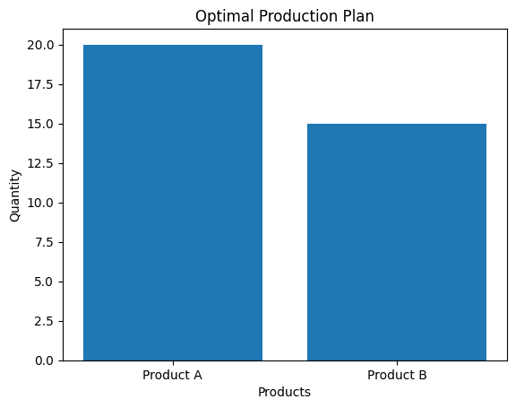

# Optimization-project
Business Optimization using Linear Programming (PuLP)

## Problem
Maximize profit for two products using Linear Programming.

## Tools Used
- Python
- PuLP
- Jupyter Notebook

## Result
Product A = 20  
Product B = 15  
Maximum Profit = 850  

## Graph

## Author
Shreya Khodake
